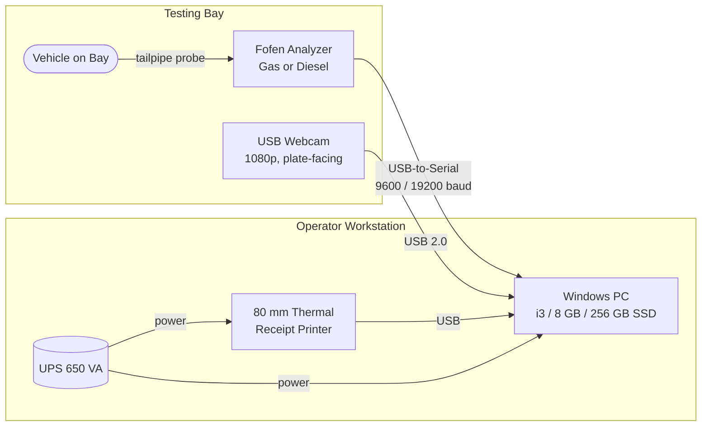
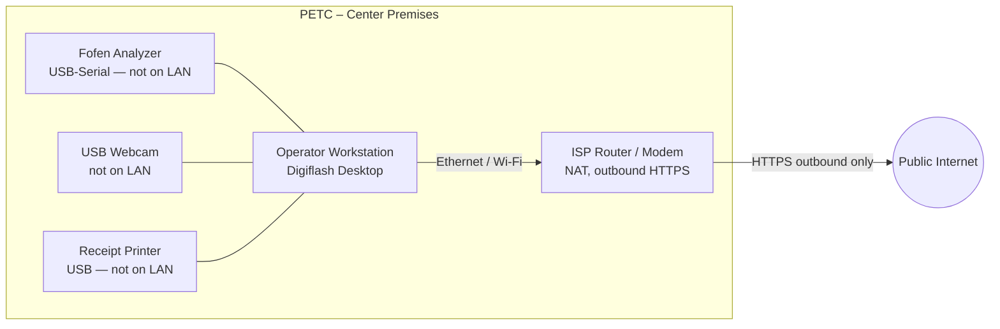
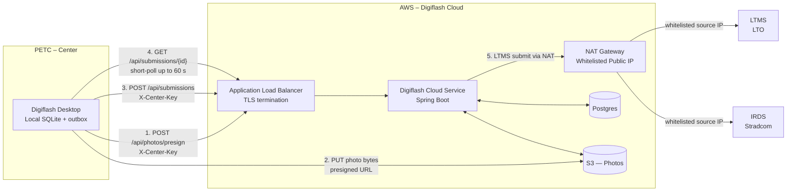

# Set-up and Network Lay-out

**Digiflash – PETC Data Submission Client**

DOTr IT Provider Accreditation – Deliverable #2

---

## Document Control

| Field | Value |
|---|---|
| Document title | Set-up and Network Lay-out – Digiflash PETC Data Submission Client |
| Document version | 0.2 (Draft) |
| Document date | 2026-06-02 |
| Product name | Digiflash |
| IT Provider | Salmon Innovations |
| Prepared by | Christian Deiniel Y. Silerio |
| Prepared for | Department of Transportation (DOTr) / Land Transportation Office (LTO) |
| Reference center | Pilot PETC (Fofen gas + Fofen diesel) |

### Revision History

| Version | Date | Author | Summary |
|---|---|---|---|
| 0.1 | 2026-06-02 | C. Silerio | Initial draft for DOTr accreditation submission. |
| 0.2 | 2026-06-02 | C. Silerio | Aligned with implemented cloud-mediated upload path: presigned S3 photo PUT, `X-Center-Key` auth, short-poll + `WAITING_FOR_LTMS` reconciler, Postgres RLS tenant isolation, explicit endpoint inventory in §6.3. |

---

## 1. Scope

This document describes the **physical set-up** and **network layout** required to deploy the Digiflash PETC Data Submission Client at one accredited Private Emission Testing Center. It establishes a minimum-viable reference design that meets DOTr functional requirements and can be replicated at every center on-boarded by Salmon Innovations.

The document covers:

1. Workstation and peripheral hardware at the testing bay.
2. Analyzer connection topology.
3. Camera specification and rationale.
4. Local-area network at the center.
5. Wide-area network: how the desktop reaches the Digiflash cloud, and how the Digiflash cloud reaches LTMS and IRDS.
6. Firewall posture and the single whitelisted IP model.
7. Capacity, redundancy, and backup.

The accompanying Network Architecture document (deliverable #6) shows the same topology at the broader cloud-platform level.

---

## 2. Reference Center Hardware (Budget Tier)

Salmon Innovations recommends the following minimum-viable hardware per accredited PETC. The specification is sized for the operational ceiling of **80 emission tests per day** per center.

### 2.1 Workstation

| Item | Specification |
|---|---|
| Form factor | Compact desktop or mini-PC |
| Operating System | Windows 10 64-bit (21H2+) or Windows 11 |
| CPU | Intel Core i3 (10th gen) or AMD Ryzen 3 (3000 series) |
| RAM | 8 GB DDR4 |
| Storage | 256 GB SSD (NVMe or SATA) |
| USB ports | 3 free USB-A (analyzer adapter, webcam, printer) |
| Display | 21.5" LED, 1920 × 1080 |
| Keyboard / mouse | Wired USB |
| Power protection | 650 VA line-interactive UPS (≥ 30 min idle runtime) |

### 2.2 Analyzer

| Item | Specification |
|---|---|
| Gas analyzer | Fofen petrol gas analyzer (CO, HC, CO₂, O₂, λ, RPM, oil temp) |
| Diesel opacimeter | Fofen diesel opacimeter (opacity, k-value, RPM, boost) |
| PC connection | USB-to-Serial adapter (FTDI / Prolific PL2303 / CH340 chipset) |
| Baud rate | 9600 (gas), 19200 (diesel) — configurable in Digiflash |

### 2.3 Webcam

| Item | Specification |
|---|---|
| Type | USB 2.0 webcam |
| Sensor | 2 MP minimum (1920 × 1080 @ 30 fps) |
| Lens | Fixed focus, 60–90° field of view |
| Low-light | ≤ 1 lux sensitivity |
| Mount | Tripod or wall bracket positioned to capture the rear plate of the vehicle on the bay |
| Quantity | 1 per testing bay (a second camera for plate capture is optional) |

See Section 4 below for the regulatory basis of this specification.

### 2.4 Receipt Printer (CEC)

| Item | Specification |
|---|---|
| Type | 80 mm thermal receipt printer, ESC/POS-compatible |
| Connection | USB |
| Paper | 80 mm × 80 m thermal roll |
| Output | Two copies per CEC issuance — Customer copy + LTO copy |

### 2.5 Network Equipment

| Item | Specification |
|---|---|
| Router / Modem | ISP-supplied unit, supporting NAT and outbound HTTPS |
| Switch (optional) | 5-port Gigabit unmanaged switch if more than one wired device |
| Cabling | Cat 5e or Cat 6 to the workstation |

---

## 3. Physical Bay Layout (Workstation, Analyzer, Camera, Printer)

The operator workstation sits at the side of the testing bay so the operator can see both the vehicle and the screen. The webcam is mounted on a tripod or wall bracket aimed at the rear of the bay to capture the vehicle and rear plate.

---

## 4. Camera Specification Basis

### 4.1 Regulatory Basis

The governing instruments for PETC IT-Provider accreditation are:

- **DOTC Department Order 2005-37** – *Rules Governing DOTC / LTO IT Providers and Monitoring of PETCs and PETC IT Providers.*
- **LTO Memorandum Circular ACL-2009-1170** – *Direct Facility Implementation*, which requires "one (1) still camera to capture an image of the vehicle undergoing testing" with the rear plate visible.

Neither issuance publishes a numeric webcam specification (resolution, frame rate, lens, low-light sensitivity). They define the **function** the camera must perform — capture vehicle + plate, upload with the CEC — and leave the hardware sizing to the accredited IT Provider.

LTO MC 2020-2195 and MC 2020-2241 are reported to contain additional PETC equipment rules but are not publicly retrievable for citation. The detailed interface specification, if any, is part of the LTO-IT System Interface Specification released only to accredited IT Providers under NDA.

### 4.2 Salmon Innovations Functional-Compliance Spec

In the absence of a public numeric spec, Salmon Innovations adopts the following functional-compliance specification, which meets every functional requirement named in the cited issuances:

| Attribute | Value | Rationale |
|---|---|---|
| Sensor | 2 MP (1920 × 1080) | Ensures the rear plate is legible at the typical bay-to-camera distance of 3–4 m. |
| Frame rate | 30 fps minimum | Allows motion-free still capture. |
| Lens | Fixed focus, 60–90° FOV | Covers a standard bay without panning. |
| Low light | ≤ 1 lux | Workable under typical indoor bay lighting. |
| Burned-in metadata | Timestamp (NTP-synced PHT), plate number, CEC reference | Supports the DO 2005-37 audit-trail intent. |
| File format | JPEG, ≤ 500 KB per image | Bandwidth-friendly for the cloud-mediated upload model. |
| Retention | ≥ 1 year locally; cloud mirror | Consistent with LTO-IT upload retention expectations. |

### 4.3 Action Item

Salmon Innovations will send a written request to LTO Law Enforcement Service / DOTr Road Transport for confirmation of the current LTO-IT System Interface Specification, including any numeric camera requirements. If LTO publishes a stricter spec, this section is updated and the field-installed webcams refreshed accordingly.

---

## 5. Local-Area Network at the Center

Important properties of the center LAN:

1. **The analyzer, webcam and printer are not on the network.** They are USB peripherals of the workstation only. They cannot be reached from the LAN or the internet.
2. **Only the workstation talks to the internet.** It opens outbound HTTPS to the Digiflash cloud. No inbound port is exposed.
3. **The Digiflash sidecar (the local HTTP service inside the desktop app) binds to `127.0.0.1` only.** It is not reachable from the LAN.

### 5.1 IP Addressing

The center LAN uses ISP-supplied addressing (usually `192.168.x.0/24` from the router's DHCP). The Digiflash desktop does not need a static IP at the center, because all communication is outbound.

---

## 6. Wide-Area Network and Upload Architecture

### 6.1 Cloud-Mediated Upload Model

LTMS and IRDS will whitelist exactly one source IP: the **AWS NAT gateway** in front of the Digiflash cloud. Centers do not connect to LTMS or IRDS directly. The cloud-mediated model has two consequences:

1. Center internet does not need a static IP, and centers can use ordinary consumer broadband.
2. LTMS / IRDS credentials live only in AWS, not on every desktop install.

### 6.2 End-to-End Data Path

The desktop application:

1. Captures the test locally and writes it to SQLite as the source of truth.
2. **Presigns and uploads each photo directly to S3** via short-lived (≤ 300 s) presigned PUT URLs issued by the cloud — photo bytes never transit the API server.
3. **Posts the test bundle** (record + S3 photo keys) to `POST /api/submissions` on the Digiflash cloud over HTTPS. Authentication uses the `X-Center-Key` header carrying the per-center API key.
4. **Short-polls** `GET /api/submissions/{id}` for up to 60 seconds. On `ACCEPTED`, the desktop receives the LTMS-issued certificate number and renders the CEC PDF locally.

The Digiflash cloud service:

1. Receives the bundle and persists it in Postgres with state `PENDING`.
2. A background job runner submits to LTMS / IRDS through the NAT gateway, whose public IP is the only one whitelisted by both registries.
3. Persists the LTMS / IRDS result and exposes it via the `GET /api/submissions/{id}` endpoint.

If the 60-second short-poll window elapses before LTMS responds, the desktop marks the submission `WAITING_FOR_LTMS` and a daemon reconciler resolves it asynchronously — see Section 6.5.

### 6.3 Outbound Endpoints from the Center

The center firewall must permit **outbound HTTPS (port 443)** to:

| Destination | Purpose |
|---|---|
| `api.digiflash.ph/api/photos/presign` | Request presigned S3 PUT URLs. |
| `api.digiflash.ph/api/submissions` | Submit test bundles; poll status. |
| `api.digiflash.ph/api/registry/vehicle/{plate}` | Vehicle lookup proxy (LTMS via cloud). |
| `api.digiflash.ph/api/registry/driver/{licenseNo}` | Driver lookup proxy (LTMS via cloud). |
| `*.s3.<region>.amazonaws.com` | Direct photo PUT to S3 using the presigned URL. |
| Standard OS update endpoints (Microsoft Update, Windows Time) | OS patching and NTP. |

The final domain (`api.digiflash.ph`) is illustrative; the production domain is fixed at deployment time.

The center firewall does **not** need to reach `lto.gov.ph`, `stradcom.com.ph`, or any LTMS / IRDS endpoint directly — those are reached by the Digiflash cloud only.

### 6.4 Outbound Endpoints from the Digiflash Cloud

The Digiflash cloud (egressing through the NAT gateway) connects outbound to:

| Destination | Purpose |
|---|---|
| LTMS submission endpoint | Emission test submission and CEC issuance. |
| IRDS (Stradcom) submission endpoint | Stradcom record update. |

Both endpoints will be configured to **whitelist only the NAT gateway's elastic IP**.

### 6.5 Offline Tolerance and Slow-LTMS Recovery

The desktop continues to capture and store tests during a center-side internet outage. Captured tests sit in the local outbox and are pushed to the cloud when connectivity is restored. CECs cannot be issued until the cloud round-trip with LTMS / IRDS completes, because the certificate number originates from LTMS.

When a submission reaches the cloud but LTMS does not respond within the 60-second short-poll window, the desktop persists the local row in state `WAITING_FOR_LTMS` and returns the operator to the History page with an "Awaiting LTMS…" indicator. A daemon thread (the **Submission Reconciler**) inside the Digiflash desktop sidecar polls the cloud every 30 seconds for any local row still in `PENDING` or `WAITING_FOR_LTMS` and updates it once the cloud reaches a terminal state. When the row flips to `ACCEPTED`, the CEC PDF is rendered locally and the **Print CEC** button becomes available from the History row without an application restart. Cloud-side retries follow a fixed back-off schedule (5 s, 15 s, 60 s, 300 s, 900 s) up to five attempts; if all attempts fail the submission is marked `DEAD` and surfaced to the operator with the LTMS rejection reason.

---

## 7. Firewall Posture

### 7.1 Center Firewall

- Default-deny **inbound** from the internet. No port is opened toward the workstation.
- Default-allow **outbound HTTPS** to the Digiflash domain.
- The local Digiflash sidecar (port 8765) is bound to `127.0.0.1` only and is not exposed to the LAN.

### 7.2 AWS Cloud Firewall (Security Groups + NACLs)

- The Application Load Balancer accepts inbound HTTPS on port 443 only.
- Application servers accept traffic only from the load balancer.
- S3 bucket policy denies all public access; photo uploads succeed only when accompanied by a valid presigned PUT URL (TTL ≤ 300 s).
- Egress to LTMS and IRDS is restricted to those two destinations and routed via the NAT gateway.
- The NAT gateway's elastic IP is the single IP communicated to LTO and Stradcom for whitelisting.

### 7.3 Authentication and Tenant Isolation

- Every desktop request to the cloud carries the `X-Center-Key` header. The cloud validates the key (bcrypt-hashed at rest) and resolves it to a tenant ID.
- Postgres Row-Level Security policies bind every row in `submissions`, `mirror_emission_tests`, `mirror_test_photos`, and related tables to a tenant ID and reject cross-tenant reads or writes at the database level — defence in depth beyond application-layer checks.
- The S3 key namespace is scoped under `tenants/{tenantId}/tests/{testId}/{photoId}.jpg`, so presigned URLs are inherently tenant-bound.

---

## 8. Capacity Planning

The pilot is sized for **80 emission tests per day per center**. Each test produces one mandatory vehicle photo (FRONT) plus up to one optional supplementary photo, sized below 500 KB after compression.

| Resource | Calculation | Result |
|---|---|---|
| Photo bandwidth per center | 80 tests × 1–2 photos × ≤ 500 KB | 40–80 MB/day outbound |
| Record bandwidth per center | 80 tests × ~10 KB JSON | ~0.8 MB/day |
| Local SQLite growth | ~50 KB/test (record + thumbnails) | ~4 MB/day, ~1.5 GB/year |
| Local photo storage | 80 × 1–2 × 500 KB | 40–80 MB/day, 15–30 GB/year |
| Cloud upload concurrency | 80 tests / 8 working hours | ~10 tests/hour, trivial concurrency |
| Short-poll API calls | 80 tests × ~60 polls (typical) | ~5,000 calls/day, trivial |

The 256 GB SSD specified in Section 2.1 accommodates more than a year of local data with margin for the operating system and the application.

---

## 9. Redundancy and Backup

### 9.1 Power

A 650 VA UPS protects the workstation, the receipt printer, and the network router for at least 30 minutes of idle runtime. This is enough to either complete an in-progress test and shut down cleanly, or to ride out a brief power dip.

### 9.2 Local Data Backup

The Digiflash desktop schedules a **daily local backup** of the SQLite database and the photo directory to a second location on the same workstation (a separate folder under `%APPDATA%\Digiflash\backup\`). The backup retention is 30 daily snapshots.

For sites that elect to attach an external USB drive, Digiflash supports redirecting the daily backup to that drive.

### 9.3 Cloud Mirror

Every accepted test record and its photo references are mirrored to the Digiflash cloud (Postgres + S3) as part of the normal upload path. This functions as an off-site backup of the record set, independent of the center workstation.

### 9.4 Workstation Failure

If the workstation hardware fails, a replacement PC is provisioned by Digiflash, the application is reinstalled with the same Center ID and API key, and the last cloud snapshot of the SQLite database is restored locally. The center resumes normal operation within one working day.

---

## 10. Commissioning Checklist

The Salmon Innovations field engineer completes the following checklist at every new center before the center goes live.

| # | Step | Verified |
|---|---|---|
| 1 | Workstation BIOS up to date, Windows fully patched | ☐ |
| 2 | Windows Time service synced to NTP (`time.windows.com` or PH NTP pool) | ☐ |
| 3 | UPS connected and battery test passed | ☐ |
| 4 | USB-to-Serial driver installed; analyzer detected on a known COM port | ☐ |
| 5 | Fofen analyzer reading captured end-to-end (gas test fixture) | ☐ |
| 6 | Fofen analyzer reading captured end-to-end (diesel test fixture) | ☐ |
| 7 | Webcam mounted and capturing a legible plate at the typical bay distance | ☐ |
| 8 | Thermal printer prints a test CEC layout | ☐ |
| 9 | Outbound HTTPS to Digiflash cloud confirmed | ☐ |
| 10 | Center API key entered; first heartbeat received by cloud | ☐ |
| 11 | One mock test submitted end-to-end and CEC printed | ☐ |
| 12 | Daily local backup job verified | ☐ |
| 13 | Operator accounts created (encoder + supervisor) | ☐ |
| 14 | Operator training delivered and acknowledged | ☐ |

---

## 11. References

- DOTC Department Order 2005-37 – *Rules Governing DOTC / LTO IT Providers and Monitoring of PETCs and PETC IT Providers.*
- LTO Memorandum Circular ACL-2009-1170 – *Direct Facility Implementation.*
- DOTr Department Order 2018-019 – privatising MVIS / PMVIC.
- DOTr Department Order 2023-008 – new PETC / PMVIC rules.
- Companion documents in this submission package:
  - `01-client-application-manual.md`
  - `03-system-documentation.md`
  - `06-network-architecture.md` (forthcoming)

---

*End of Set-up and Network Lay-out – Digiflash PETC Data Submission Client.*
