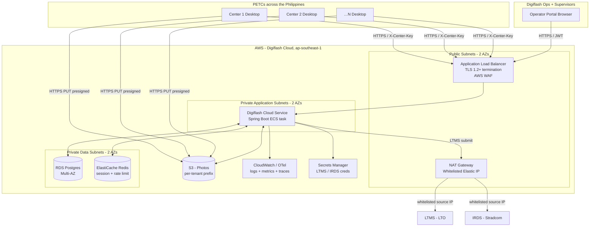
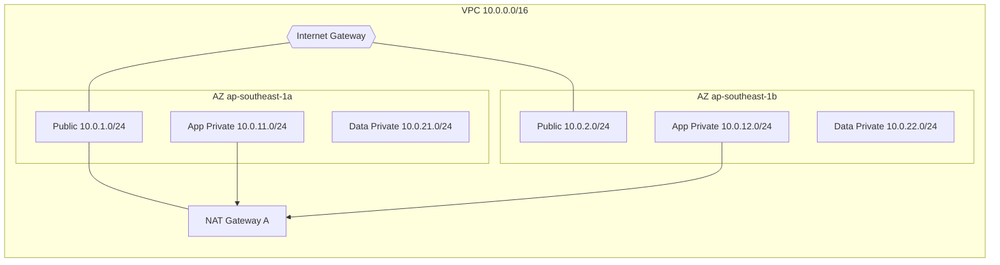
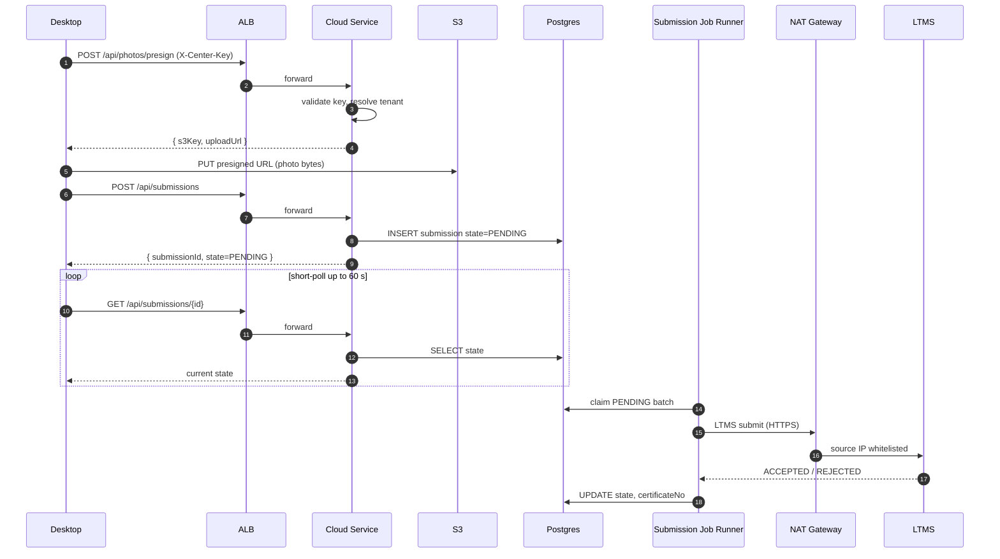
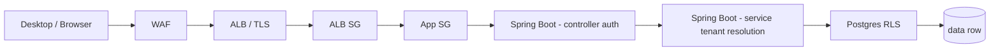

# Network Architecture

**Digiflash – PETC Data Submission Client**

DOTr IT Provider Accreditation – Deliverable #6

---

## Document Control

| Field | Value |
|---|---|
| Document title | Network Architecture – Digiflash PETC Data Submission Client |
| Document version | 0.1 (Draft) |
| Document date | 2026-06-02 |
| Product name | Digiflash |
| IT Provider | Digiflash |
| Prepared by | Christian Deiniel Y. Silerio (Lead Developer, Digiflash) |
| Prepared for | Department of Transportation (DOTr) / Land Transportation Office (LTO) |
| Companion documents | `02-setup-and-network-layout.md` (center perspective) |

### Revision History

| Version | Date | Author | Summary |
|---|---|---|---|
| 0.1 | 2026-06-02 | C. Silerio | Initial draft. AWS platform perspective complementing the center-perspective view in deliverable #2. |

---

## 1. Scope

This document describes the **end-to-end network architecture** of the Digiflash platform that supports DOTr-accredited Private Emission Testing Centers (PETCs) submitting test results to LTMS and IRDS.

Deliverable #2 (*Set-up and Network Lay-out*) covers the topology **inside** a single PETC and the path from one center to the cloud. This deliverable covers the topology **inside the AWS cloud** and the path from the cloud to the government registries.

Together the two documents form a complete network picture from the analyzer's serial port to the LTMS API.

The document covers:

1. Logical and physical AWS topology (VPC, subnets, availability zones).
2. Public ingress: how desktop applications and the operator portal reach the cloud.
3. Internal data flows between cloud services.
4. Egress posture: how the cloud reaches LTMS and IRDS through a single whitelisted IP.
5. Boundary controls: security groups, NACLs, WAF, RLS, S3 bucket policy.
6. Observability and audit posture.
7. Capacity, resilience, and disaster-recovery posture.

The text reads as an *aspirational* / *target* architecture sized for the production roll-out, not the pilot footprint. Where the pilot footprint diverges (single instance, single AZ, MinIO for local dev), it is called out explicitly in §10.

---

## 2. Architecture at a Glance

Key architectural properties:

- **Single VPC, two availability zones** within the AWS Asia-Pacific (Singapore) region (`ap-southeast-1`). Locating the workload outside the Philippines is deliberate: it places Digiflash on a stable, geographically-redundant region while keeping latency to PH centers acceptable (typically 60–90 ms round-trip).
- **Single NAT gateway elastic IP** is the only address communicated to LTMS and Stradcom for whitelisting. All cloud-to-gov traffic egresses through it.
- **Photo bytes never enter the API server.** Desktops upload directly to S3 with short-lived presigned URLs, freeing the application tier from large file-handling load.
- **Multi-tenant by design.** Every persisted row carries a `tenant_id`; Postgres Row-Level Security enforces isolation in the database; S3 prefixes scope photos to a tenant.

---

## 3. AWS Region and Availability Zone Topology

### 3.1 Region selection

| Property | Choice | Reason |
|---|---|---|
| Region | `ap-southeast-1` (Singapore) | Lowest-latency AWS region with mature service availability serving the Philippines; supports all services used (ALB, ECS, RDS Multi-AZ, ElastiCache, S3, Secrets Manager). |
| Availability zones | 2 of 3 (e.g. `ap-southeast-1a`, `ap-southeast-1b`) | Sufficient for HA at this workload scale; Multi-AZ RDS replicates across both. |

### 3.2 VPC layout

- **Public subnets** host the Application Load Balancer and the NAT gateway. They are the only subnets with a route to the Internet Gateway.
- **App private subnets** host the Spring Boot application tasks. They route outbound traffic via the NAT gateway. Inbound traffic arrives only from the ALB.
- **Data private subnets** host the RDS Postgres primary and standby and the ElastiCache Redis cluster. They have **no route to the internet** at all.
- S3 access from the application uses a **VPC Gateway Endpoint** so photo and S3 API traffic never leaves the AWS backbone.
- Secrets Manager access uses a **VPC Interface Endpoint** for the same reason.

A second NAT gateway in AZ B may be added for AZ-failure independence; the pilot footprint uses a single NAT gateway in AZ A for cost — see §10.

---

## 4. Public Ingress

Two distinct ingress paths terminate on the Application Load Balancer:

### 4.1 Desktop application traffic

- **Source**: any DOTr-accredited PETC running the Digiflash desktop client.
- **Protocol**: HTTPS, TLS 1.2 or newer, validated certificate (AWS Certificate Manager).
- **Authentication**: `X-Center-Key` header carrying the per-center API key. The cloud validates the key (bcrypt-hashed at rest) and resolves it to a `tenant_id`.
- **Endpoints used**:
  - `POST /api/photos/presign` — request a presigned S3 PUT URL.
  - `POST /api/submissions` — enqueue a test bundle for LTMS submission.
  - `GET /api/submissions/{id}` — poll for the LTMS result.
  - `GET /api/registry/vehicle/{plate}`, `GET /api/registry/driver/{licenseNo}` — registry lookups proxied to LTMS / IRDS via the NAT gateway.

### 4.2 Operator portal traffic

- **Source**: Digiflash operations staff and authorised PETC supervisors.
- **Protocol**: HTTPS, TLS 1.2 or newer.
- **Authentication**: JSON Web Token (JWT) bearer issued after operator-portal login. JWT carries the operator identity, role, and tenant scope. Refresh tokens are server-tracked and revocable.
- **Endpoints used**: `/portal/...` namespace covering test history browsing, center licence administration, and CEC reprint workflows. Tenant scope is enforced at both the application layer (controller-level checks) and the database layer (Postgres RLS).

### 4.3 AWS WAF rules

The Application Load Balancer is fronted by AWS WAF with the following managed and custom rule groups enabled:

| Rule group | Purpose |
|---|---|
| AWS Managed Rules — Common Rule Set | Block known web exploits (OWASP top-10 patterns). |
| AWS Managed Rules — Known Bad Inputs | Block malformed and exploit-pattern requests. |
| AWS Managed Rules — IP Reputation List | Block sources on the AWS threat-intel reputation list. |
| Custom rate limit on `/api/submissions` | Hard cap per `X-Center-Key` to bound abuse from a compromised key. |
| Custom rate limit on `/portal/auth/login` | Bound credential-stuffing attempts. |

---

## 5. Internal Data Flows

### 5.1 Test submission

### 5.2 Background job runner

A scheduled task inside the Spring Boot service polls Postgres every 2 seconds for `PENDING` submissions, calls the gov client, and persists the terminal state. Retries follow a fixed back-off schedule of 5 s, 15 s, 60 s, 300 s, 900 s, up to five attempts; after five failures the submission is marked `DEAD` and surfaced to the operator portal for manual review.

### 5.3 Operator portal flows

The operator portal is served from a separate AWS S3 + CloudFront origin (or hosted behind the same ALB at a sibling path, depending on the deployment choice). It calls the same Spring Boot service under a `/portal/...` namespace authenticated with JWT bearer tokens. RLS policies use the JWT's tenant claim to bind every query to the operator's authorised tenant set.

---

## 6. Egress to LTMS and IRDS

Egress is the most sensitive boundary in the architecture because it is the only path that touches government-owned systems.

### 6.1 Single source IP

The NAT gateway has one stable Elastic IP. Digiflash communicates that IP to:

- LTO Law Enforcement Service (for LTMS whitelisting).
- Stradcom Corporation (for IRDS whitelisting).

LTMS and IRDS accept connections from this one address only. No individual PETC IP is ever whitelisted, which is the core operational reason the cloud-mediated path exists.

### 6.2 Outbound destinations

| Destination | Purpose | Protocol | TLS |
|---|---|---|---|
| LTMS submission endpoint (hostname TBC by LTO) | Emission test submission + CEC issuance. | HTTPS | Required, certificate validation enforced. |
| LTMS registry endpoint (hostname TBC by LTO) | Vehicle and driver lookup. | HTTPS | Required, certificate validation enforced. |
| IRDS submission endpoint (hostname TBC by Stradcom) | Stradcom record update. | HTTPS | Required, certificate validation enforced. |

The specific hostnames and any port deviations are TBC until LTO Law Enforcement Service and Stradcom complete the IT-Provider onboarding handshake with Digiflash. The current code carries a stub for the Stradcom client (`StradcomGovRegistryClient`) that is wired by configuration and is the only place the live integration goes when credentials and an API specification are handed over.

### 6.3 Credential handling

LTMS and IRDS credentials are stored in **AWS Secrets Manager** with rotation enabled. The application tier loads them at startup via a VPC interface endpoint; they are never written to disk and never logged. A deliberate compliance property of the cloud-mediated model is that no PETC desktop install holds gov credentials.

### 6.4 Egress restriction

The application tier security group permits outbound traffic only to:

- The RDS, ElastiCache, and S3 endpoints inside the VPC.
- The NAT gateway for traffic destined to LTMS / IRDS.
- AWS Secrets Manager and CloudWatch service endpoints.

NACLs on the application subnets reinforce this restriction so a compromised application task cannot reach arbitrary internet hosts.

---

## 7. Boundary and Trust Controls

### 7.1 Layered defence

A request originating from a compromised center cannot, by design, read another center's data even if it bypasses every application-layer check, because Postgres RLS enforces tenant scope at the database row level.

### 7.2 Controls summary

| Boundary | Control | Implementation |
|---|---|---|
| Internet → ALB | WAF | AWS managed rule sets + custom rate limits. |
| Internet → ALB | TLS | TLS 1.2+ enforced by the ALB listener. |
| ALB → app subnets | Security group | Only ALB SG is allowed; no other ingress. |
| App → RDS | Security group | RDS SG accepts traffic only from the app SG on port 5432. |
| App → S3 | IAM role + bucket policy | App task role allows only `PutObject` / `GetObject` on the `petc-photos` bucket; bucket denies all public access; only presigned URLs grant brief PUT permission to external callers. |
| Tenant boundary | Postgres RLS | Every multi-tenant table has an RLS policy keyed on `current_setting('app.tenant_id')`; the application sets the tenant via `SET LOCAL` on each transaction. |
| Tenant boundary | App-layer check | Controllers resolve the request tenant from `X-Center-Key` or JWT and pass it to the data layer. |
| Cloud → LTMS / IRDS | Egress allowlist | Application SG and route table restrict egress to the NAT gateway for these two destinations. |
| Cloud → LTMS / IRDS | Whitelisted source IP | LTMS / IRDS see only the NAT gateway elastic IP. |
| Secrets | Secrets Manager | LTMS / IRDS credentials never on disk, never in environment files, rotated. |
| Audit | Append-only `audit_log` | Every test submission, status transition, operator login, and licence change is recorded. |

---

## 8. Observability and Audit

| Concern | Mechanism |
|---|---|
| Application logs | Structured JSON logs streamed to CloudWatch Logs; one log group per service. |
| Metrics | CloudWatch metrics for ALB, NAT bytes, RDS CPU + replication lag, ECS task health. |
| Traces | OpenTelemetry traces with the test submission as the root span; sampled at 100 % for the LTMS submission path. |
| Audit log | Append-only Postgres `audit_log` table records every submission, status transition, operator login, and centre-licence change with actor, tenant, action, before / after, and timestamp. |
| Retention | Logs ≥ 90 days hot, archived to S3 Glacier for 2 years. Audit log retained for 5 years to support DOTr / LTO audit requests. |
| Alerting | CloudWatch alarms for: NAT bytes out anomaly, ALB 5xx rate, RDS replication lag, Submission DEAD rate, Submission Job Runner backlog. |

Audit-log entries are immutable: writes only, no updates, and the table is excluded from RLS bypass so even the application service account cannot modify history.

---

## 9. Resilience and Disaster Recovery

| Layer | Resilience posture | Recovery objective |
|---|---|---|
| Application tier | At least two ECS tasks across two AZs; ALB target group health-checks; rolling deploys with no-traffic gate. | Single-task failure ≤ 30 s; AZ failure recovered without operator action. |
| Database | RDS Multi-AZ with synchronous replication to standby. | RPO ≈ 0; RTO ≈ 1–2 min on automatic AZ failover. |
| Database backups | Automated daily snapshots retained 30 days; PITR enabled within the 5-day backup window. | Recover any committed state to any second in the last 5 days. |
| Photo storage | S3 with versioning enabled; cross-region replication to a secondary region for the production tier. | Object-level durability ≥ 11 × 9s; region failure mitigated by replica. |
| Secrets | Secrets Manager replicated across regions. | Recoverable without manual intervention. |
| Center continuity | Desktop persists locally to SQLite as source of truth and uploads on reconnect; the `WAITING_FOR_LTMS` state plus the daemon reconciler absorb cloud-side slowness. | Centres keep capturing tests during cloud or LTMS outages; CECs issued when LTMS becomes available. |

DR exercises: a quarterly tabletop and an annual recovery exercise restoring from snapshot to a clean environment, with the result included in the next accreditation renewal cycle.

---

## 10. Pilot Footprint vs Target Footprint

The architecture above describes the **target production footprint**. The pilot footprint at the time of this submission diverges from the target in the following respects, all of which are tracked as scale-out work items in the Digiflash roadmap.

| Concern | Pilot today | Target production |
|---|---|---|
| Application tier | Single Spring Boot instance, one AZ. | Two or more ECS tasks across two AZs. |
| Database | Single RDS Postgres instance (or PostgreSQL on container for local dev). | RDS Postgres Multi-AZ with read replica. |
| Cache | None (or Redis container in dev). | ElastiCache Redis Multi-AZ. |
| Object store | MinIO (local dev) / single-region S3 bucket. | S3 with versioning + cross-region replication. |
| NAT gateway | Single NAT GW in one AZ. | Optionally one NAT GW per AZ. |
| WAF | Disabled or minimal in dev. | Full managed rule set as in §4.3. |
| Observability | CloudWatch logs only. | Logs + metrics + traces + alarms as in §8. |

All pilot deviations are about *scale and resilience headroom*, not about boundary controls. The single-IP NAT egress posture, RLS tenant isolation, X-Center-Key authentication, and S3 presigned-URL photo path are identical between pilot and production, so the security model presented to LTMS / IRDS does not change as the platform scales.

---

## 11. Cross-References

- `02-setup-and-network-layout.md` — center-side hardware, LAN, and the desktop → cloud edge of the same data path.
- `01-client-application-manual.md` — operator-facing description of the same flows from the desktop UI.
- `03-system-documentation.md` — software-architecture description of the components shown above.
- Source code repositories: `cloud/src/main/java/com/petc/` (application tier), `desktop/sidecar/petc/` (desktop sidecar), `shared/contracts/` (the four JSON schemas pinning the desktop ↔ cloud API).

---

*End of Network Architecture – Digiflash PETC Data Submission Client.*
