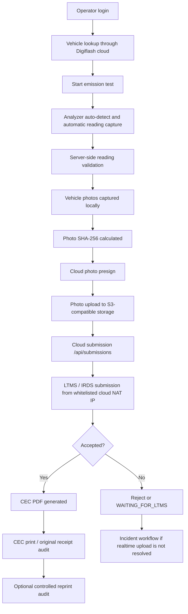

# PETC Data Flowchart

**Baseline:** DOTr Department Order No. 2023-008, Annex 6 / PETC Form 02

## Data Stores

| Store | Data | Protection |
|---|---|---|
| Local SQLite | Test record, readings, photos metadata, audit log, print history | Workstation ACLs, loopback-only sidecar |
| Local filesystem | Captured photo bytes and CEC PDFs | Workstation ACLs |
| Cloud Postgres | Tenant/center authorization, numbered lanes, lane credentials, submissions, quota, audit/reporting data | Tenant/lane isolation, lane-credential auth, RLS where enabled |
| Object storage | Uploaded vehicle photos | Presigned PUT, tenant/lane/test scoped object keys |
